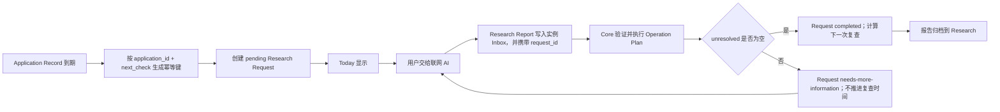

# Application Tracker 日常使用契约（阶段三）

## 第一版实体

| 实体 | 用途 | Schema |
| --- | --- | --- |
| Application Instance | 一组申请的区域、入学季和目录边界 | `application-instance.schema.json` |
| Application Record | 一个学校专业申请的主档案；学校、专业、要求、Offer 和签证信息暂时作为结构化字段保留在这里 | `application-record.schema.json` |
| Research Report | 一次联网核验的证据、发现和未解决问题 | `research-report.schema.json` |
| Application Document | 一项材料的准备、提交状态和文件位置 | `application-document.schema.json` |

Research Request 是工作流控制记录，不是第五个业务实体。第一版不拆 University、Program、Requirement、Offer 或 Visa 实体。

## 申请状态机

所有状态变化都属于必须审核字段；研究报告只能提出变化，用户确认后才能执行。实现定义位于 `src/application/stateMachine.ts`。

| 状态 | 可从何处进入 | 进入任务 | 停止监控 | Today | 用户确认 |
| --- | --- | --- | --- | --- | --- |
| watching | initial | 安排开放核验 | 无 | 等待申请周期开放 | 是 |
| not-open | watching, open | 安排下次开放核验 | 无 | 等待下次核验 | 是 |
| open | watching, not-open | 启动材料清单 | 无 | 开始准备材料 | 是 |
| preparing | open | 补材料、确认截止时间 | 无 | 显示缺失材料 | 是 |
| submitted | preparing | 确认 submitted_at、保存回执 | 开放和要求监控 | 确认提交证据 | 是 |
| awaiting-result | submitted | 监控结果 | 开放和要求监控 | 等待结果 | 是 |
| conditional-offer | awaiting-result | 核对条件 | 开放和要求监控 | 完成 Offer 条件 | 是 |
| unconditional-offer | awaiting-result, conditional-offer | 核对并决定 Offer | 开放、要求和结果监控 | 决定是否接受 | 是 |
| accepted | conditional-offer, unconditional-offer | 确认押金、准备 COE | 开放、要求和结果监控 | 完成押金与 COE | 是 |
| coe-issued | accepted | 准备签证 | 申请与 Offer 监控 | 准备签证申请 | 是 |
| visa-processing | coe-issued | 监控签证 | 申请与 Offer 监控 | 等待签证 | 是 |
| completed | visa-processing | 无 | 全部 | 不显示行动 | 是 |
| rejected | awaiting-result, conditional-offer | 记录原因、考虑备选 | 全部 | 显示备选行动 | 是 |
| withdrawn | 除终态外任一活动状态 | 记录撤回 | 全部 | 不显示行动 | 是 |
| archived | completed, rejected, withdrawn | 无 | 全部 | 不显示 | 是 |

不允许跳过关键事实，例如 `open → submitted` 会被状态机拒绝。

## 字段风险等级

| 等级 | 字段 | 行为 |
| --- | --- | --- |
| 自动更新 | last_checked, next_check, source_files, source_refs, verification_log | 由高置信度处理链自动刷新；无变化核验可以追加普通日志 |
| 必须审核 | application_status, application_open, deadline, tuition, academic_requirement, english_requirement, credit_exemption | 创建 Review Item，批准后才进入最终 Operation Plan |
| 事前确认 | submitted_at, offer_accepted, deposit_paid, coe_received, visa_submitted | 只能由用户主动确认；Research Report 中出现时标记 `user-confirmation-required` 并创建 `confirm-user-action` 审核项，只有用户明确确认后才能写入 |
| 未登记字段 | 其他字段 | 第一版默认进入审核，避免 Schema 扩展时意外自动写入 |

## Research Request 生命周期

规则：

- 对应关系由报告的 `request_id` 建立，并额外核对 Instance、Application Record ID 和记录路径。
- 无变化且 `unresolved` 为空仍然代表核验完成，Request 正常关闭。
- 报告不完整时 Request 保持开放，状态为 `needs-more-information`，原到期时间不向后推进。
- 一个 Request 可依次接收多份报告，`report_ids` 保存全部报告；一个报告只能声明一个 Request。
- 幂等键为 `application-check:{application_id}:{next_check}`；同一个申请和核验周期只能存在一个开放 Request。
- `pkb application research-sync --vault PATH` 扫描全部到期项目并批量生成缺失 Request。
- 用户把任务交给联网 AI 时运行 `pkb application research-start REQUEST_ID --vault PATH`，将 Request 标记为 `in-progress`；重复执行保持幂等。

## Application Dashboard 信息结构

每个 Application Record 生成一个项目摘要，只包含：当前项目、当前状态、下次核验、待审核变化数量、材料完成数/总数、最近更新时间和下一步行动。开放的 Research Request 单独生成行动项；Inbox 文件继续显示为待处理项。

材料进度来自 Application Document：`ready` 和 `submitted` 计为完成，`not-applicable` 不进入分母。第一版不做排名、复杂图表或自动择校。

## 多项目测试方案

自动化测试覆盖：

1. 两个不同 Instance 的到期 Application Record 一次同步各创建一个 Request；
2. 重复同步不创建重复 Request；
3. 不同 Application ID 即使核验时间相同，幂等键也不同；
4. 一份不完整报告使 Request 保持开放，后续完整报告关闭同一个 Request；
5. 非法状态跳转被拒绝；
6. 事前确认字段不能由研究结果写入。

后续端到端扩展应覆盖十个以上项目混合到期、单项目多份报告、部分项目存在待审核项、材料清单为空和终态项目停止监控。
