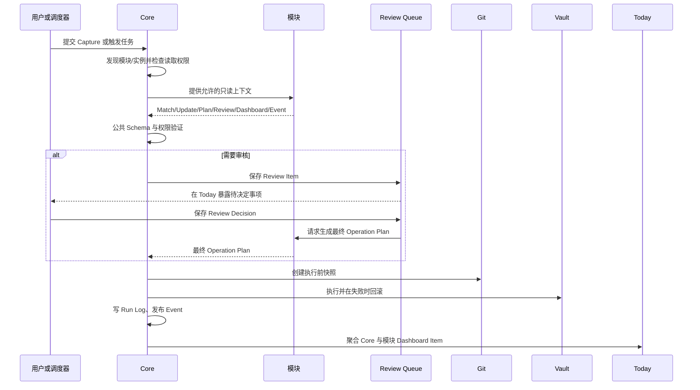

# Core 与模块边界（阶段二）

## 结论

> 模块只提出结构化计划，核心平台负责验证和执行。

`src/application/` 是 application-tracker 的只读判断与提案层；`src/core/` 提供不含业务语义的机制；`src/platform/` 负责组装模块输出与 Core 执行能力。模块不能直接产生文件、Git、Review Queue 或 Today 副作用。

## Core Capability Map

| Core 能力 | 当前实现 | 责任 |
| --- | --- | --- |
| 文件读取和写入 | `src/core/files.ts`, `bridge.ts` | Vault 相对路径解析、安全读写、原子写入 |
| Frontmatter 解析 | `src/core/bridge.ts` | Markdown/YAML 解析与序列化 |
| JSON Schema 验证 | `src/core/bridge.ts`, `tools/pkb_bridge.py` | 在执行前验证公共及模块 Schema |
| Operation Plan | `src/core/operationExecutor.ts` | 权限检查、顺序执行、失败回滚 |
| Git 快照 | `src/core/git.ts` | 执行前创建或确认 Vault 快照 |
| 日志 | `src/core/logs.ts` | 验证并保存 Run Log |
| Review Queue | `src/core/reviews.ts` | 审核项持久化、队列流转、到期重排 |
| Today 聚合 | `src/core/dashboard.ts` | 合并并验证 Dashboard Item，统一渲染 |
| 幂等性 | Operation 的 `idempotency_key` 与处理状态 | 防止报告或追加段落重复执行 |
| 模块与实例发现 | `src/core/discovery.ts` | 发现并验证 manifest 与 instance |

## 能力归属表

| 类别 | 能力 |
| --- | --- |
| Core | 文件读取和写入；Frontmatter 解析；JSON Schema 验证；Operation Plan；Git 快照；日志；Review Queue；Today 聚合；幂等性；模块与实例发现 |
| Shared Components | 状态机；Research Request；周期调度；附件 Sidecar；时间线；对比表 |
| application-tracker | 申请状态；关键字段；招生信息比较；申请档案；学校和专业匹配；申请专属审核规则 |

Shared Components 是可复用协议或算法，不拥有文件、Git、Today 等执行权限。当前状态机和对比逻辑已有原型；Research Request、周期调度、Sidecar、时间线会在后续按实际复用需求实现，暂不继续扩张 Schema。

## 模块允许与禁止事项

模块只能：

- 读取 Core 按权限提供的上下文；
- 返回 Match Result、Update Result 或 Operation Plan；
- 提出 Review Item、Dashboard Item；
- 发布 Event。

模块不得：

- 直接写文件或目录；
- 直接执行 Git；
- 直接写入或重建 Today；
- 移动其他模块文件；
- 绕过 Review Queue；
- 自行执行 Operation Plan；
- 使用未授权的绝对路径或 Vault 外路径。

`tools/check_core_boundaries.py` 会阻止模块源代码导入上述副作用能力，并阻止 Core 代码或 Schema 出现 `Monash`、`application_open`、`tuition`、`english_requirement`、`program_code`、`Applications`。

## 稳定版公共 Schema

| Schema | 核心用途 |
| --- | --- |
| `module-manifest` | 声明模块能力、入口、权限和依赖 |
| `instance` | 模块实例的通用身份、状态和 Vault 根路径 |
| `capture` | Core 向模块提供的捕获文件信封 |
| `match-result` | 模块对捕获内容的路由判断 |
| `operation-plan` | 模块提出、Core 执行的唯一变更协议 |
| `review-item` | 需要人工决定的结构化提案 |
| `review-decision` | 用户决定及其时间、备注、修改值 |
| `dashboard-item` | 模块与 Core 向 Today 提供的统一展示项 |
| `event` | 平台内的可扩展领域事件信封 |
| `run-log` | 一次执行与 Git 快照的审计记录 |

`common.schema.json` 只保存这些契约复用的内部定义，不计作第十一个公共消息类型。

公共字段约定：

- 持久化工作流 ID 使用大写前缀、年份和至少六位序号，例如 `REV-2026-000001`；模块 ID 使用 kebab-case；实例 ID 使用稳定的字母数字、点、下划线或连字符。
- 时间均为 RFC 3339 `date-time`，Core 默认生成 UTC `Z`；外部输入可携带明确时区偏移，禁止无时区时间。
- 所有文件位置均为 Vault 相对路径，统一使用 `/`，禁止盘符、绝对路径和 `..` 逃逸。
- 来源模块统一命名为 `source_module`；实例引用统一为 `instance_id`；Instance 自身所属模块使用 `module_id`。
- `status` 只存在于拥有生命周期的对象；Operation Plan 不复制 Review 状态。
- 所有 `confidence` 均引用公共定义，范围为闭区间 `0–1`。
- Event 类型使用可扩展的 `namespace.action` 命名，不在 Core 枚举业务事件。

## 模块调用时序



## 自动验收

运行：

```powershell
npm run check:boundaries
npm test
python -X utf8 tools/validate.py --vault ../knowledgeos-vault
```

边界检查覆盖 Core 业务词泄漏、模块副作用调用、十个公共 Schema 是否齐全及遗留同义字段。测试覆盖模块/实例发现、Operation Plan 授权执行与失败回滚，以及阶段一审核闭环。
