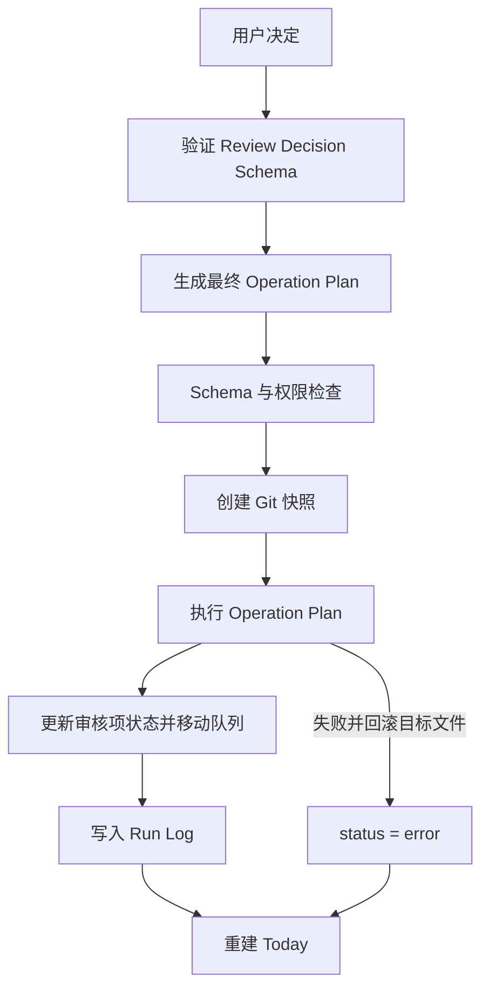

# Review 闭环规范

## 1. 数据存储与字段所有权

审核项以 Markdown 文件保存，结构化状态位于 YAML Frontmatter：

```text
90-System/Review Queue/
├── Pending/   等待用户决定、讨论中或错误重试后重新打开
├── Deferred/  尚未到提醒时间
├── Closed/    approved、approved-with-modification、rejected、resolved-by-user-edit
└── Error/     Operation Plan 执行失败
```

当前决定存入审核项的 `decision`，全部历史存入 `decision_history`。决定结构由 `core/schemas/review-decision.schema.json` 约束。

用户填写：

- `decision`
- `user_comment`
- `review_after`（仅 defer）
- `modified_value`（仅 approve-with-modification）

系统生成：

- `review_id`（从被处理的审核项复制）
- `decided_at`
- 审核状态、Operation Plan ID、Run ID、Git 快照和执行结果

决定修改规则：

- `pending + discuss` 仍保持 pending，可以继续讨论或提交最终决定；所有讨论保留在 `decision_history`。
- `deferred` 在到期前不可直接改判；到期后由系统重新进入 pending。
- `approved`、`approved-with-modification`、`rejected`、`resolved-by-user-edit` 均为终态，禁止重复处理。
- `error` 只能通过 `review retry` 回到 pending，失败决定保留在历史中。

## 2. 状态机

| 状态 | 可从何处进入 | 决定可修改 | Today 显示 | Operation Plan | 已关闭 |
|---|---|---:|---:|---|---:|
| pending | initial、deferred、error | 是；讨论可继续追加 | 是 | 尚未决定 | 否 |
| approved | pending | 否 | 否 | 必须执行 | 是 |
| approved-with-modification | pending | 否 | 否 | 必须执行 | 是 |
| rejected | pending | 否 | 否 | 生成零操作 Plan | 是 |
| deferred | pending | 否；到期先回 pending | 否 | 不生成 | 否 |
| resolved-by-user-edit | pending | 否 | 否 | 不生成 | 是 |
| error | pending | 否；retry 后回 pending | 是 | 失败 Plan 保留 | 否 |

```mermaid
stateDiagram-v2
    [*] --> pending
    pending --> approved: approve
    pending --> approved-with-modification: approve-with-modification
    pending --> rejected: reject
    pending --> deferred: defer
    pending --> pending: discuss
    pending --> resolved-by-user-edit: YAML matches proposal
    pending --> error: execution failure
    deferred --> pending: review_after reached
    error --> pending: retry
```

## 3. 审核执行流程

审核系统只记录决定并编排流程；正式档案只能由经过验证和权限检查的 Operation Plan 修改。



规则：

- approve：使用 `proposed_value.new_value`，更新对应 Fact、来源、核验时间及关联 `application_status`。
- approve-with-modification：只使用用户提供的 `modified_value`，不允许扩大审核字段范围。
- reject：正式字段保持不变，生成并保存零操作 Plan，拒绝原因保存在审核项和日志中。
- defer：不生成 Plan，移动至 Deferred；到期后在 Dashboard 构建或 reconcile 时回到 Pending。
- discuss：不生成 Plan，保持 Pending，并追加决定历史。

权限检查只允许最终 Plan 对原审核项的 `target` 执行 `update-frontmatter` 和 `append-section`，且操作必须携带同一个 `requires_review_id`。

## 4. 用户直接修改目标文件

`pkb review reconcile` 只比较明确的 YAML 字段：

- 当前值等于建议值，并且关联状态字段一致：转为 `resolved-by-user-edit` 并关闭。
- 当前值仍等于旧值：保持 pending。
- 当前值既不等于旧值也不等于建议值：保持 pending，并在 Today 显示“目标文件已被修改，但关联审核项仍未关闭”。

第一版不分析正文语义。

## 5. CLI

```powershell
# 直接批准
pkb review decide REV-2026-000001 approve --comment "已核对官网" --vault "D:\MyVault"

# 修改后批准；--value 必须是合法 JSON
pkb review decide REV-2026-000001 approve-with-modification --value "48000" --comment "采用修正值" --vault "D:\MyVault"

# 拒绝
pkb review decide REV-2026-000001 reject --comment "证据不足" --vault "D:\MyVault"

# 延后
pkb review decide REV-2026-000001 defer --review-after "2026-08-15T09:00:00+08:00" --vault "D:\MyVault"

# 讨论
pkb review decide REV-2026-000001 discuss --comment "需要补充来源" --vault "D:\MyVault"

# 对账全部 pending，或只对账一个审核项
pkb review reconcile --vault "D:\MyVault"
pkb review reconcile REV-2026-000001 --vault "D:\MyVault"

# 将 error 恢复为 pending
pkb review retry REV-2026-000001 --vault "D:\MyVault"
```

## 6. 验收用例

自动化测试覆盖：

1. 直接批准：执行两项受限操作、更新值和来源、关闭审核。
2. 修改后批准：只应用用户修正值。
3. 拒绝：正式字段不变、零操作 Plan 留档、终态禁止重复处理。
4. 延后：移出 Today，到期后重新进入 pending。
5. 讨论：保持 pending，后续决定追加到历史。
6. 用户直接修改：精确匹配自动关闭，模糊修改在 Today 告警。
