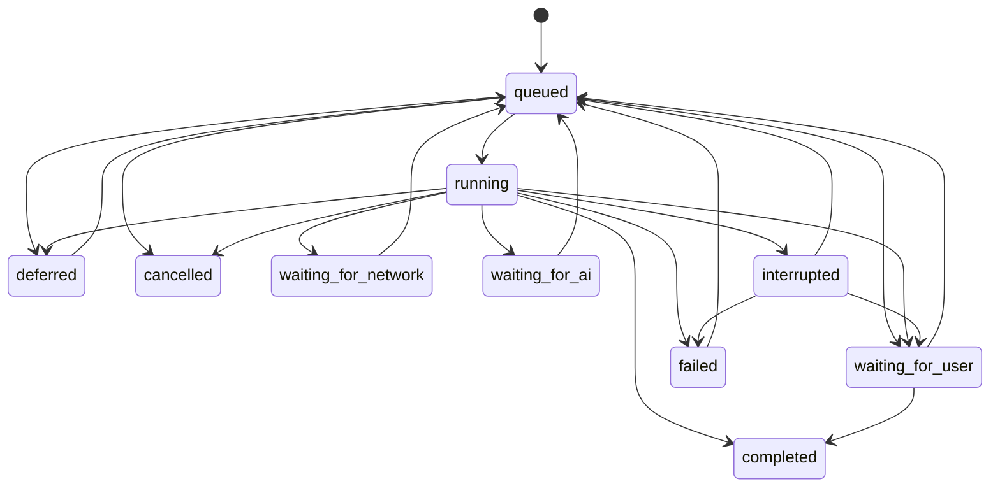

# Task Runner Domain Model v0.1

Milestone G introduces a Core-owned, local task runtime. Modules declare jobs; they never open `runtime.db`, acquire worker locks, or execute scheduled writes directly.

## Objects

| Object | Meaning | Identity and lifetime |
| --- | --- | --- |
| Job Definition | A reusable declaration of work, trigger, resources, retry and catch-up policy | Stable `job_id`; registered by Core or a module |
| Task | One business occurrence of a Job in a schedule/event/manual window | Stable `TASK-*`; retries do not create another Task |
| Task Run | One execution attempt | New `RUN-*` for every attempt |
| Resource Status | Last observed availability of filesystem, network, Codex or user | One row per resource |
| Task Dependency | A simple prerequisite relation between Tasks | `all-success`, `all-finished` or `any-success` |
| Scheduler Checkpoint | How far Scheduler evaluated one Job | One row per Job |

The durable source of truth is `90-System/State/runtime.db`. Markdown is a projection for Today and Task Center, not a queue.

## State machine

`completed`, `failed`, and `cancelled` are terminal for automatic scheduling. A manual retry moves the same failed Task back to `queued` and creates a new Run. `cancelled` is immutable; a deliberate force-run must use a different idempotency key.

## Persistence guarantees

- SQLite uses WAL, foreign keys, a five-second busy timeout, explicit transactions, and a unique Task idempotency key.
- State transitions are validated and compare the previous state in the update.
- Runtime IDs are allocated inside the same database transaction as Task/Run creation.
- Schema migrations are versioned in `runtime_metadata`.
- Backup checkpoints WAL and atomically publishes a database copy. Restore preserves the displaced database as a `.damaged-*` file if one existed.
- Payloads contain references and workflow parameters, not copied sensitive source documents.

The existing Python bridge requirement provides SQLite through Python's standard library. This avoids experimental Node flags and native npm database dependencies while preserving one stable TypeScript Repository boundary.
